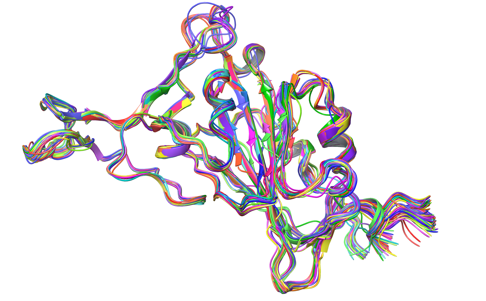

# RBD-AlphaFold2-structures-and-phenotypic-information

## This repository is provded alongside AlphaFold2 data found at: 
### https://figshare.com/projects/SARS-CoV-2_RBD_single_mutant_AlphaFold2_structures/150089 

#### The scripts are presented to reproduce all reasults in the paper titled: "SARS-CoV-2 RBD deep mutational AlphaFold2 structures carry phenotypic information"

# Getting started. 
## Download and unzip the data running (for linux/mac).
`./data_prepare.sh`
### This data can also be downloaded manually.

# Data structure created:

## FASTA
- wuahn
- alpha 
- beta
- delta
- eta
- omicron_ba1
- omicron_ba2

## Structures
- wuahn
- alpha 
- beta
- delta
- eta
- omicron_ba1
- omicron_ba2

# Visualising structural distorition on mutation.
`../data_usage_scripts/xyz_variation_at_position.ipynb`

# Simple statistics and antibody escape plots notebook.
`../antibody_escape/antibody_escape_vs_structuraldistortion.ipynb`

# Wuhan generalization experiment:
`cd wuhan_generalization_experiments`
### To create all embeddings and run random forest classifier experiment.
`./wuhan_generalization.sh`
### Then to visualise reasults with the notebook:
`./RF_generalization_plot.ipynb`

# Umap reasults figure:
### Visualise embeddings (representations) of the generated dataset.
`./projections/UMAP_all_vars_structs.ipynb`

# Scripts to create PQR files
### Create PQR files for further downstream tasks.
`./data_usage_scripts/PQR-APBS.ipynb`

## FoldX RBD protein expression prediction experement.
### Run FoldX stabvility function for all structures with foldX software installed.
`./foldX_stability/foldx_expression_prediction.py`
